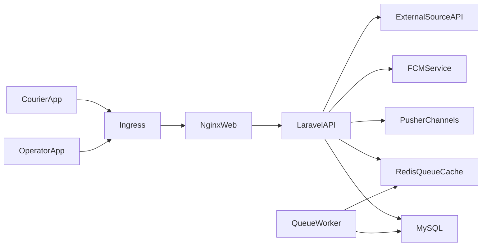

# Architecture (Docker + Kubernetes)

## Target Runtime Topology

- `php-fpm` app container for Laravel code execution
- `nginx` container (or ingress + sidecar approach) for HTTP serving and static files
- `mysql` database (managed service or StatefulSet)
- `redis` for cache/queue/broadcast backend option
- `queue-worker` deployment for async jobs
- `scheduler` deployment/cronjob for periodic tasks (if enabled)
- Optional `horizon` deployment if queue orchestration is upgraded later

## Logical Components

1. API Layer
   - Sanctum-authenticated REST API from `routes/api.php`
   - Controllers in `API/V1` and `API/V2/courierApp`
2. Domain Layer
   - Eloquent models in `app/Models`
   - Business logic in service classes (`app/Services`)
3. Event/Realtime Layer
   - Broadcast events in `app/Events`
   - Channels used by clients:
     - `operator_orders`
     - `operator_couriers`
     - `courier_{id}`
     - `chatbox`
4. Notification Layer
   - FCM push sender (`Appy\FcmHttpV1\FcmNotification`)
5. Integration Layer
   - External source callbacks via HTTP to `source_url` endpoints
   - SMS/WhatsApp code delivery abstractions

## Deployment Units (K8s)

- `Deployment/api` (php-fpm + app code)
- `Deployment/web` (nginx)
- `Service/api` (cluster-internal)
- `Service/web` (cluster/internal or ingress backend)
- `Ingress/web` (public entrypoint)
- `Deployment/worker` (queue worker process)
- `CronJob/scheduler` (optional, per minute)
- `Job/migrate-seed` (run migrations and selected seeders)

## Storage and Volumes

- Persistent write path required for:
  - `storage/app`
  - `storage/logs`
  - `bootstrap/cache` (runtime writable)
- Shared or build-time static for:
  - `public/`
  - compiled front assets (`public/js`, `public/css`)
- If avatars are local filesystem (`storage/public/avatar`), use:
  - PVC for app pods
  - or move to object storage (recommended for scale)

## Networking and Security

- Ingress TLS termination at edge
- Internal service-to-service traffic in namespace
- Secrets for DB/Pusher/FCM/SMS credentials
- ConfigMaps for non-sensitive app config
- Readiness/liveness probes:
  - `/` or health endpoint
  - php-fpm process check for worker pods

## Runtime Profiles

- API pods: autoscaling based on CPU/RPS
- Worker pods: autoscaling based on queue depth/CPU
- Separate resource requests/limits for API and worker

## High-Level Flow

## Compatibility Notes

- Current repo has no first-party Docker/K8s manifests at root.
- Existing `Dockerfile`/`docker-compose.yml` inside `public/adm-build/AdminLTE-3.2.0` are vendor/demo artifacts and must not be reused for production app runtime.
