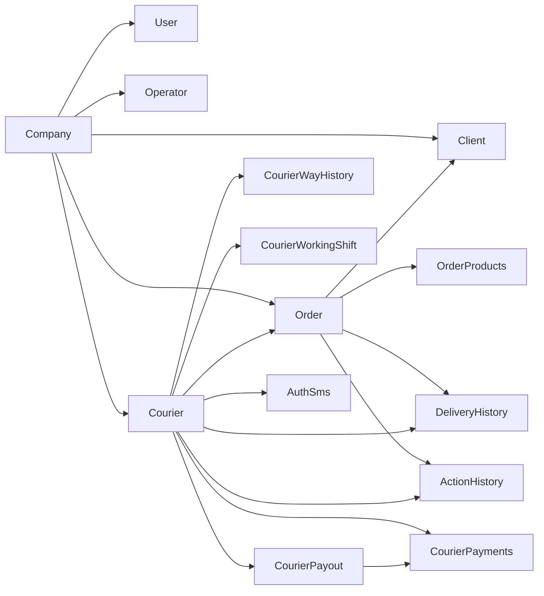

# Domain Models and Data Types

## Modeling Principles In Current Project

- Eloquent is primary ORM.
- `BaseModel` applies shared global scope infrastructure.
- `HasOwnerCompany` trait auto-fills `company_id` on create for company-owned entities.
- Multiple models include computed attributes (e.g., `is_paid`, `approved`, courier full name).

## Core Actors

### `User`
- Purpose: generic authenticated user
- Important fields: `id`, `name`, `email`, `password`, `fcm_token`, auth tokens relation
- Key methods: `getCourierInfo()`, `is_courier()`, `getPushToken()`

### `Company`
- Purpose: tenant/organization account
- Important fields: `id`, `parent_id`, `name`, `email`, `phone`, `password`, `remember_token`, `fcm_token`, `status`
- Behavior:
  - `default_roles = ['company', 'create-outer-order']`
  - token generation method persists plain token in `remember_token`

### `Operator`
- Purpose: operator account in company context
- Important fields: `name`, `email`, `password`, `company_id`
- Roles: `default_roles = ['operator']`

### `Courier`
- Purpose: delivery performer and courier app principal
- Important fields:
  - profile: `first_name`, `last_name`, `otchestvo`, `phone`, `avatar`
  - runtime: `coordinates`, `status`, `transport`, `fcm_token`
  - work state: `current_order`, `company_id`, `user_id`
- Constants:
  - transports: `car`, `moped`, `walk`, `bicycle`
  - payout events: `create_payout`, `confirm_payout`
- Relations:
  - `orders()` active assigned orders (`status in [2,3]`)
  - `completed_orders()` (`status=4`)
  - `payments()`, `payouts()`
  - `working_shifts()`, `today_working_shift()`
  - `last_coordinates()`
  - `deliveries()`

## Commerce and Delivery

### `Order`
- Purpose: delivery order lifecycle aggregate
- Important fields:
  - identity: `id`, `number`, `company_id`
  - location: `address_from`, `address_to`, `coordinates_from`, `coordinates_to`
  - participants: `courier_id`, `client_id`
  - financial/time: `price`, `award`, `payment_type`, `distance`
  - timing: `order_created_at`, `order_delivery_start_at`, `order_close_time`, `order_close_at`
  - source integration: `source_url`
- Casts:
  - `address_to` decoded as array
- Status constants:
  - `1 onstock`, `2 taked`, `3 pickup`, `4 delivered`, `5 cancelled`
- Relations:
  - `courier()`, `client()`, `products()`

### `Client`
- Fields: `id`, `name`, `phone`, `company_id`
- Relation: `orders()`

### `OrderProducts`
- Fields: `name`, `price`, `cost_price`, `quantity`, `external_id`, `order_id`

## Auth and Verification

### `AuthSms`
- Purpose: phone auth code lifecycle with expiry and rate limits
- Fields: `courier_id`, `ip`, `phone`, `code`, `expires_at`, `company_id`
- Behavior:
  - code generated in `creating` hook
  - optional fixed code from settings in test mode
  - dispatches via `AuthService::send`
- Scopes:
  - `unexpired()`
  - `limiter()`

## Tracking and Histories

### `CourierWayHistory`
- Fields: `coordinates`, `distance`, `transport_id`, `order_id`, `courier_id`
- Behavior: `addWayHistory($courier)` computes incremental movement distance

### `DeliveryHistory`
- Fields:
  - delivery times, `order_id`, `courier_id`, `client_id`
  - scoring fields: `score`, `time_planned`, `time_spent`
  - payment fields: `award`, `price`, `payment_type`
  - metadata: `number`, `point`, `company_id`
- Behavior: `add_history($order)` computes score based on planned vs spent time

### `ActionHistory`
- Fields: `order_id`, `courier_id`, `code`, `text`, `type`
- Purpose: audit/event timeline records

### `CourierWorkingShift`
- Fields: `type` (`open`/`close`), `courier_id`
- Purpose: shift open/close log

## Financials

### `CourierPayments`
- Fields: `award`, `distance`, `order_id`, `courier_id`, `courier_payout_id`, `company_id`
- Relations: `order()`, `courier()`, `payout()`
- Computed:
  - `is_paid` based on related payout approval
  - `is_paid_text`

### `CourierPayout`
- Fields: `courier_id`, `sum`, `approve`
- Casts: `sum` float, `approve` boolean
- Relations: `courier()`, `payments()`
- Computed: `approved`, `approve_text`

## Support

### `Transport`
- Fields: `id`, `code`, `name`, `company_id`

### `Courier_orders` (legacy bridge)
- Fields: `courier_id`, `order_id`, `main`
- Note: active code mostly uses direct `orders.courier_id`

## Entity Relationship Summary

