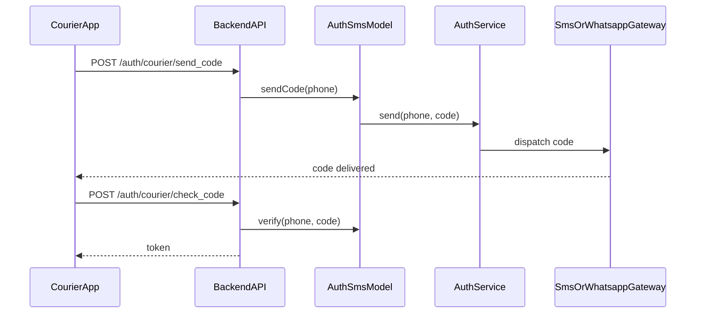
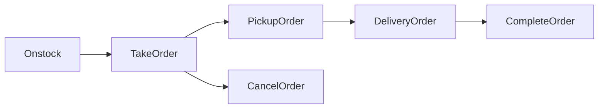
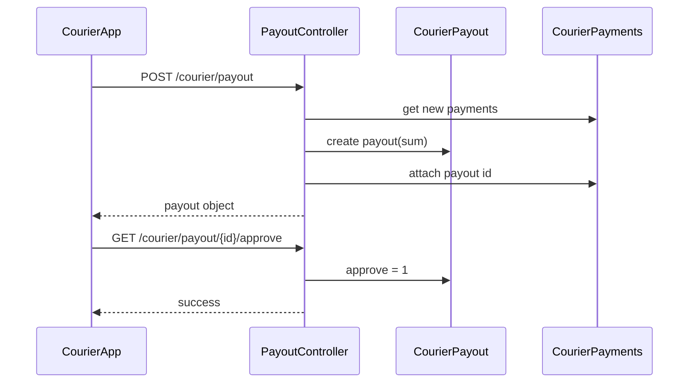

# Business Interactions

## 1) Courier Auth by Code

### Flow Summary

1. Courier app calls `POST /auth/courier/send_code`.
2. Backend normalizes phone via `Str::phoneNumber`.
3. Backend checks courier existence by phone.
4. `AuthSms::sendCode` creates auth record and generates code.
5. `AuthService::send` routes delivery to RedSMS or WhatsApp channel depending on setting.
6. Courier app sends `POST /auth/courier/check_code`.
7. Backend verifies code in `auth_sms` and issues Sanctum token via `TokenService`.

## 2) Order Creation and Notification

### Flow Summary

1. Operator/external source creates order (`/orders/add`).
2. Backend resolves or creates `Client`.
3. Backend writes `Order` and `OrderProducts`.
4. Backend calculates courier award (distance/fixed/proc rules).
5. Backend logs action (`ActionHistory`).
6. Backend emits:
   - `NewOrderEvent` to `operator_orders`
   - `newOrdersForCourier` to each online courier channel (`courier_{id}`)
7. Backend sends push via FCM (`NotificationService::couriersNotice`).

## 3) Order Lifecycle (Take -> Pickup -> Delivery -> Complete)

### Main states

- `1` onstock
- `2` taked
- `3` pickup
- `4` delivered
- `5` cancelled

### Transition behavior highlights

- `takeOrder`
  - assigns courier
  - sets `order_delivery_start_at`
  - if first active order for courier, sets `courier.current_order`
  - emits `UpdateOrderEvent`
  - emits `UpdateCourierOrders` refresh to online couriers
- `pickupOrder`
  - sets status pickup
  - emits `UpdateOrderEvent` + `UpdateCourierOrder`
  - optional external callback to source URL
- `deliveryOrder`
  - marks delivered-in-progress state path in current code
  - emits update events
- `completeOrder`
  - sets close timestamp and delivered status
  - clears `courier.current_order`
  - writes `DeliveryHistory`
  - writes `CourierPayments`
  - emits finish events
  - optional external callback `finish_order`

## 4) Courier Coordinates Tracking

### Flow Summary

1. Courier app sends `POST /courier/coordinates`.
2. Backend updates `couriers.coordinates`.
3. `CourierWayHistory::addWayHistory` appends movement record and distance delta.
4. Backend emits courier update event for operator dashboards.
5. If courier has `current_order` and `source_url`, backend sends update callback to external source endpoint.

## 5) Work Shift Management

### Open shift

- API: `POST /courier/work_shift`
- Writes `courier_working_shifts` (`type = open`)
- Sets courier status online
- Emits `UpdateCourierEvent` type `courier_shift_update`

### Close shift

- API: `DELETE /courier/work_shift`
- Writes `courier_working_shifts` (`type = close`)
- Sets courier status offline
- Emits `UpdateCourierEvent` type `courier_shift_update`

## 6) Payout Workflow

### Flow Summary

1. Courier requests payout (`POST /courier/payout`).
2. Backend loads unpaid `CourierPayments` (`courier_payout_id is null`).
3. Backend creates `CourierPayout(sum = payments.sum(award))`.
4. Backend associates each payment to payout.
5. Backend emits `UpdateCourierEvent` with `create_payout`.
6. Approval path sets `approve = 1` and emits `confirm_payout`.

## 7) Real-Time Channels Contract

- Operator-facing channels:
  - `operator_orders`
  - `operator_couriers`
- Courier-personal channels:
  - `courier_{courierId}`
- Auxiliary:
  - `chatbox`

Rebuild requirement:
- Preserve event names/payload fields currently consumed by clients (`event_type`, minimal order/courier payload in pusher resources).
